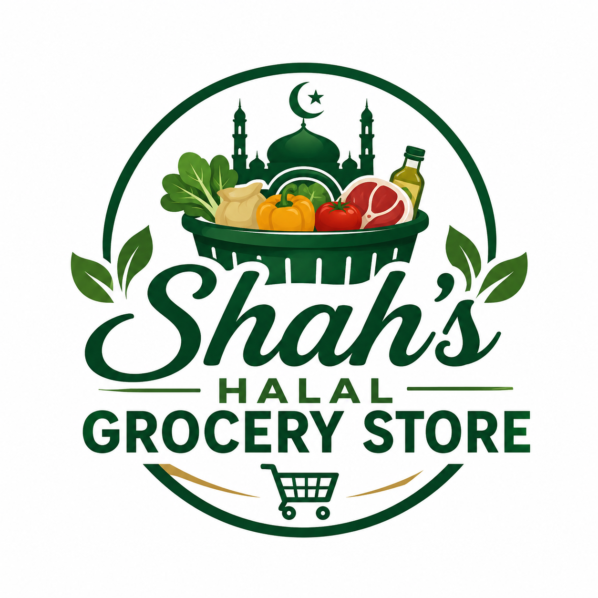
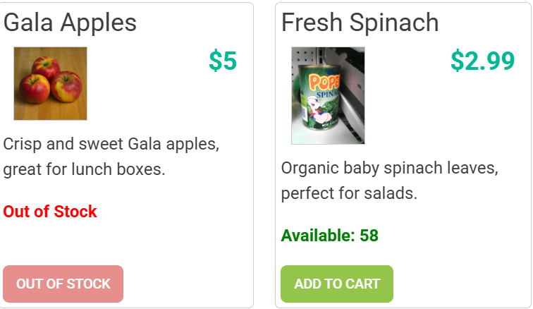

#  Shah's Halal Grocery Store

Shah's Halal Grocery Store is a full-stack grocery shopping web application built using **Java Spring Boot**, **HTML**, **CSS**, **JavaScript**, **Mustache Templates**, and **MySQL**. The application allows customers to browse halal grocery products, manage shopping carts, place orders, and maintain personal profiles, while administrators can manage products, categories, inventory, and customer orders through an admin dashboard.

This project demonstrates full-stack web development concepts including REST APIs, Spring Boot architecture, authentication and authorization with JWT, CRUD operations, database integration, frontend development, role-based security, and object-oriented programming.

---

# Running the Code

The easiest way to run the application is:

1. Open the project in IntelliJ IDEA.
2. Start the Spring Boot backend.
3. Ensure MySQL is running and the Grocery Store database is configured.
4. Open the frontend in your browser.
5. Register a new account or log in.
6. Browse products, add items to your cart, and place an order.

---

# 🌟 Features

## Customer Features

* 🔐 User Registration & Login
* 👤 Profile Management
* 🛒 Shopping Cart
* 📦 Checkout System
* 💵 Cash on Delivery Confirmation
* 📋 Product Search & Filtering
* 📂 Category Filtering
* 💰 Price Filtering
* 📷 Product Image Preview
* 📦 Live Stock Availability
* 🚫 Out of Stock Protection
* 📉 Automatic Stock Reduction After Checkout

---

## Admin Features

* 📊 Admin Dashboard
* 📦 Product Management

    * View Products
    * Add Products
    * Edit Products
    * Delete Products
    * Search Products
* 📂 Category Management

    * View Categories
    * Add Categories
    * Edit Categories
    * Delete Categories
* 📑 Order Management

    * View Orders
    * Search Orders
    * View Customer IDs
    * View Shipping Address
    * View Order Totals
* 📈 Dashboard Statistics

    * Total Products
    * Total Categories
    * Total Orders
    * Total Revenue
    * Recent Orders

---

# Technologies Used

### Backend

* Java 17
* Spring Boot
* Spring Security
* Spring Data JPA
* JWT Authentication
* MySQL

### Frontend

* HTML5
* CSS3
* JavaScript
* Axios
* Mustache.js
* Bootstrap

---

# Application Architecture

The application follows the Spring Boot layered architecture:

* Controller Layer
* Service Layer
* Repository Layer
* Entity Models
* MySQL Database

The frontend communicates with the backend through REST APIs using Axios.

---
## Demo Login Credentials

You can use the following accounts to explore the application:

### 👑 Administrator Accounts

| Username  | Password     | Role          |
| --------- | ------------ | ------------- |
| **admin** | **password** | Administrator |
| **omor**  | **omor1234** | Administrator |

### 👤 Customer Account

| Username | Password    | Role     |
| -------- | ----------- | -------- |
| **ifty** | **ifty123** | Customer |

> **Note:** These accounts are provided for demonstration and testing purposes only.

# Code I'm Most Proud Of

I am most proud of the complete shopping and inventory workflow. When a customer places an order, the application validates that the shopping cart is not empty, checks whether sufficient inventory is available, automatically reduces product stock after a successful purchase, stores the order in the database, and clears the customer's shopping cart.

I am also proud of building the Admin Dashboard, which provides administrators with the ability to manage products, categories, orders, inventory, and sales statistics from one centralized interface.

---

# My Personal Challenges

One of the biggest challenges I faced was completing and validating all five backend testing phases using Insomnia before integrating the frontend. Each phase introduced new REST API endpoints that had to be tested thoroughly to ensure they returned the correct status codes, handled errors properly, and interacted correctly with the database.

Another challenge was implementing inventory management. I needed to ensure stock was validated before checkout, automatically reduced after successful purchases, and displayed correctly to customers while preventing out-of-stock items from being purchased.

I also spent significant time improving the user interface by creating an admin dashboard, adding category and product management pages, displaying order statistics, and designing a shopping experience that resembles a real online grocery store.

These challenges helped strengthen my understanding of REST APIs, Spring Security, database design, JavaScript, asynchronous programming, and debugging techniques.

---

# What I'd Do If I Had More Time

If I had more time, I would add several advanced e-commerce features including:

* ❤️ Customer Wishlist
* ⭐ Product Reviews and Ratings
* 📧 Email Order Confirmations
* 💳 Online Payment Integration (Stripe or PayPal)
* 🚚 Order Tracking
* 📊 Sales Charts and Analytics
* 🔔 Low Stock Notifications
* 📱 Responsive Mobile Design
* 🧾 Printable Receipts
* 🔍 Advanced Product Search

These features would make the application even closer to a production-ready online grocery platform.

---

# Next Time...

Next time I would spend more time designing the database relationships and frontend layouts before beginning development. Better planning would reduce refactoring and make the project easier to maintain.

I would also write more automated tests, improve documentation throughout development, and organize frontend components into reusable modules earlier in the project.

Overall, I would continue focusing on cleaner architecture, stronger testing practices, and building an even better user experience.

---

# Author

**Shah Ali Omor**

Year Up United — Capstone 3

Shah's Halal Grocery Store
